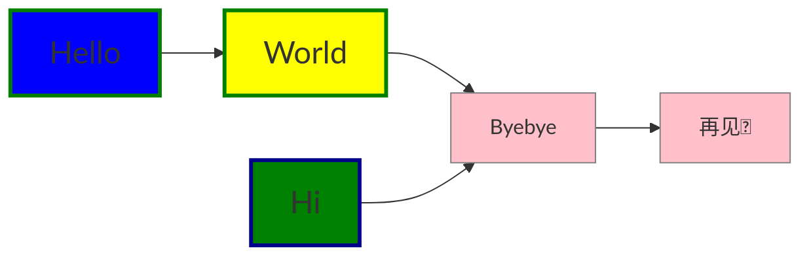

# Mermaid Debug

hello

```mermaid
graph LR; A[Hello]-->B[World]; B-->D[Byebye]; C[Hi] --> D --> E[再见👋]

%% Class Definitions
classDef default fill: pink, stroke: gray, font-family:Lato;

class A cssClassA;
class B cssClassB;
class C cssClassC;
classDef cssClassA fill: blue, stroke: green, stroke-width:3px, font-size:24px;
classDef cssClassB fill: yellow, stroke: green, stroke-width:3px, font-size:24px;
classDef cssClassC fill: green, stroke: darkblue, stroke-width:3px, font-size:24px;
```
